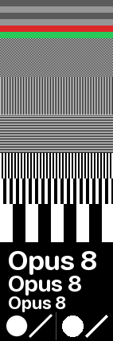

# claude-code-keyboard-status

Live [Claude Code](https://claude.com/claude-code) state on the 142×428 image
display of a mechanical keyboard — 2.79 in of glass, read from where your hands
already are: what Claude is doing right now, which model is answering, and how much
of your 5-hour and weekly budget is gone.


The character on top is the whole point. From across a desk you cannot read a
project name, but you can tell a spinning orange bloom from a sleeping one — and the
yellow badge means Claude is blocked on a permission prompt and has been waiting
for you.

The panel carries four facts and no more, each set large enough to read without
leaning in. That number is not a style choice — it falls out of the arithmetic
below.

## Install

```sh
curl -fsSL https://raw.githubusercontent.com/williamliu0516/claude-code-keyboard-status/main/install.sh | sh
```

That downloads `keyboard_status.py` to `~/.claude/`, builds a private virtualenv
with Pillow in it, loads a launchd agent that keeps the pusher running across
logins, and registers five hooks in `~/.claude/settings.json`, leaving every other
setting and every other tool's hooks alone. Re-run it to upgrade.

Needs macOS, `python3` (3.8+) with `venv`, and `curl` or `wget`. Then open a new
session, or restart an existing one, for the hooks to load — the daemon starts
pushing immediately either way.

The keyboard defaults to `192.168.0.12`. To point it somewhere else, edit `url` in
`~/.claude/keyboard-status.json` and the daemon picks it up on its next tick.

<details>
<summary>Install from a clone, or without hooks</summary>

```sh
git clone https://github.com/williamliu0516/claude-code-keyboard-status
python3 claude-code-keyboard-status/keyboard_status.py --install
```

`--install --no-hooks` sets up the daemon and never touches `settings.json`. You
lose the "needs your permission" state; everything else still works.
</details>

## Uninstall

```sh
python3 ~/.claude/keyboard-status.py --uninstall
```

Unloads the agent, deletes the script, the virtualenv, the state file and the
launchd plist, and removes exactly our five hook entries from `settings.json`.
Your `keyboard-status.json` is left alone, and so is
`~/.claude/statusline-usage.json`, which belongs to the sibling project below.

## What it shows

| Cell | Set at | Reads as |
| --- | --- | --- |
| `5H` / `7D` | **25 px cap / 22.5′** | percent of the 5-hour and weekly windows used, over a 20 px meter |
| model | 24 px cap / 21.6′ | `Opus 5`, `Sonnet 5`, … auto-fitted to the width |
| character | 80 px / 12.6 mm / 72′ | the session state, as a pose — see the table below |
| state badge | 20 px cap / 18.0′ | `BUSY` · `YOU` · `IDLE` · `OFF` |
| clock | 20 px cap / 18.0′ | local time, centred under a rule |

Meters are green below 50%, amber to 75%, orange to 90%, red above.

The order of that table is the order of the hierarchy, and it is not the order
things appear on screen. The two meters and the model name are why the panel
exists, so they hold `CORE_SIZE` unconditionally. The character and the badge are
emphasis — they make the panel readable *as a shape* from further away than any
text — so they are what gives ground when the budget runs short. The character was
106 px and is now 80: still 12.6 mm across, still 72 arcmin, still in no danger of
being hard to see, and 26 px shorter. The badge went from 47 px tall to 34. That
bought back the clock, which had been cut in the previous round.

## How the sizes were chosen

Not by eye. The panel is **2.79 in** on the diagonal at 142×428, which fixes
everything else:

```
diagonal   sqrt(142² + 428²) = 450.9 px
density    450.9 / 2.79      = 161.6 ppi   →  1 px = 0.157 mm
physical   22.3 mm × 67.3 mm               →  narrower than a finger
```

Read while typing, the keyboard sits about **600 mm** from your eyes. Character
height for a given visual angle is `D · tan(arcmin / 60°)`, so at that distance:

| Visual angle | Character height | Meaning |
| --- | --- | --- |
| 16′ | 2.79 mm → **17.8 px** cap | the comfortable floor |
| 22′ | 3.84 mm → **24.4 px** cap | easy at a glance — **the target** |
| 28′ | 4.89 mm → **31.1 px** cap | low light, peripheral vision |

San Francisco's cap height measures **0.71–0.73** of PIL's `size` parameter —
measured with `textbbox`, not assumed, because the ratio wanders by a point or two
with hinting — so 24.4 px of cap height is **`size` 34**. That is `CORE_SIZE`, and
everything the panel exists to tell you is set there.

The corollary is the part that took a redesign to accept: **161.6 ppi on a 22 mm
strip does not buy detail, it buys about six legible characters per line.** 428 px
of height is a high number attached to a very small piece of glass.

So width, not height, is what decides the vocabulary:

| At `CORE_SIZE` | Width | vs. 122 px available |
| --- | --- | --- |
| `NEEDS YOU` | 192 px | doesn't fit; best case is `size` 22 → **14.4′**, under the floor |
| `WORKING` | 163 px | doesn't fit; best case `size` 25 → **16.2′**, at the floor |
| `5H 100%` | 145 px | doesn't fit |
| `Haiku 4.5` | 153 px | doesn't fit; best case `size` 27 → 18.0′ |
| `BUSY` | 92 px | fits |
| `Opus 5` | 113 px | fits |
| `5H` + `100` | 107 px | fits |

Hence the three changes that look like aesthetic decisions and are not:

- **The state words got shorter, not smaller.** `NEEDS YOU` cannot reach even the
  16′ floor in 122 px. Colour and pose were already carrying the nuance those
  extra letters added, so `BUSY` · `YOU` · `IDLE` · `OFF` it is.
- **The per-cent sign went.** `5H 100%` is 145 px; `5H` + `100` is 107. A number
  sitting on top of a meter does not need the glyph, and keeping it would have
  meant shrinking both.
- **The model name auto-fits.** `Opus 5` clears the target outright; `Haiku 4.5` is
  three characters longer than the panel can carry at that size and gets `size` 27
  (18.0′) rather than dragging every other name down to the worst case. The row
  reserves the full height either way, so nothing below it moves.

`--status` still prints everything, at any length, in a terminal that has room.

### The top 40 rows are not yours

The physical panel sits behind the device's own cutouts, so the first 40 rows are
covered — not dim, not cropped, gone. `DEAD_ZONE` records that, every vertical
coordinate is derived from `MASCOT_TOP` below it, and `docs/make_preview.py` fails
the build if any state puts a single non-background pixel above the line. That
leaves **358 usable rows**, which is the budget the layout is solved against.

40 is measured, not assumed: `--testcard`'s top band is an 8 px ladder with the
step above the line in red and the step below it in green. On the panel the red is
invisible and the green is not, so the line is in the right place — if anything a
row or two conservative, which is the direction to be wrong in.

### What is deliberately missing

The project name, the git branch, the session title, the reset countdowns, the
effort chip, the footer clock and the "last activity" stamp were all here once, at
9–15 px — which is **7–11 arcmin** from where this thing is read. Each was a cell
you could see but not read, and a cell you cannot read is worse than no cell,
because it still costs the space. The trades:

- **project and branch** — you know which repo you are in; the terminal says so.
- **session title / prompt** — a wrapped sentence is the one thing a 22 mm strip
  can never make glanceable. Reading it means leaning in, and if you are leaning
  in, the terminal is right there.
- **reset countdowns** — the least urgent usage fact, and a whole row per meter.
- **effort** — needs its own row at a readable size, and `MODEL` outranks it.
- **activity stamp** — the character already answers "is anything happening".
- **the clock** — cut for one round to buy cap height, then bought back when the
  character and badge gave up 40 px. It sits at `STATE_SIZE`, not `CORE_SIZE`:
  legible at 600 mm and visibly not competing with the numbers above it.

All of it is still collected. Only the drawing stopped.

## The four states

| Badge | Pose | Means |
| --- | --- | --- |
| **`BUSY`** | clay bloom, turning, eyes tracking | a turn is in flight, or the transcript grew in the last 45 s |
| **`YOU`** | amber, wide eyes, `!` badge | Claude asked for permission and is blocked on you |
| **`IDLE`** | dusty rose, eyes closed, `z` | the turn ended, or nothing has happened for a while |
| **`OFF`** | grey, flat eyes | no session found at all |

The bloom advances a few degrees every tick while working, which makes "still
alive" legible without reading anything. In every other state it holds still.

At 12.6 mm across the character subtends 72 arcmin — more than three times the
22′ target — which is why it is the element that gets shrunk when something has to
give, and why it still reads from further away than any of the type. It
used to throw three twinkles onto a wide orbit while working; they were ~9 arcmin
— under the threshold where anything resolves — and that orbit, not the bloom, was
what capped the character's size, because it clipped both margins first. Dropping
them bought 6 px of bloom, which you can actually see.

## Is it actually point-to-point? — yes

**Tested on the glass, and the answer is yes.** The 1 px checkerboard, both 1 px
gratings and every block size come up crisp on the panel, so the device is *not*
resampling 142×428 to some other native grid, and the display is not the limiting
factor. The 8 px ladder confirmed `DEAD_ZONE` too: the red band above the 40 px
line is invisible, the green one below it is not.

What was read as "blurry" was type below the readability threshold — the same
observation as *"bigger text is clearer"*, which is what a 15 arcmin glyph looks
like next to a 22 arcmin one, not what a soft panel looks like. That is fixed by
[sizing from the physics](#how-the-sizes-were-chosen), not by a sharpening pass.

The card is kept because it is how that got settled, and because it catches the
opposite failure too — see [the antialiasing A/B](#the-antialiasing-ab).

`--testcard` renders it:

```sh
keyboard_status.py --testcard              # POST it to the panel
keyboard_status.py --testcard card.png     # or just look at it locally
```



Geometry only — no state, no layout, and no fonts on the fine bands:

| Rows | Pattern | What softness there means |
| --- | --- | --- |
| 0–48 | 8 px ladder, red band above the 40 px line, green below | if no red is visible, `DEAD_ZONE` is right |
| 48–96 | 1 px checkerboard | flat grey = the device is rescaling |
| 96–192 | 1 px vertical, then horizontal lines | which axis the scaler loses |
| 192–256 | 2 px and 4 px vertical lines | if even 4 px is soft, it is the panel itself |
| 256–304 | 16 px hard-edged blocks | **the control.** Nothing in our pipeline can blur an edge this coarse |
| 304–390 | text at 34 / 28 / 22, native size | compare against the blocks |
| 390–428 | **antialiasing A/B**, split by a hairline at x=70 | left pair smooth, right pair stepped = working |

### What was ruled out on this side, with numbers

Measured, not assumed — the card round-trips through our own encoder and gets
compared to the source bitmap pixel by pixel:

| Band | Max error after JPEG | Contrast surviving |
| --- | --- | --- |
| 1 px vertical lines | **0** / 255 | 255 / 255 |
| 1 px horizontal lines | **0** / 255 | 255 / 255 |
| 2 px / 4 px / 16 px | **0** / 255 | 255 / 255 |
| 1 px checkerboard | 2 / 255 | 255 / 255 |
| text | 8 / 255 | 255 / 255 |

A 1 px checkerboard is very nearly a pure DCT basis function, so 4:4:4 JPEG carries
it almost exactly — which is what makes the card a clean test rather than a test of
JPEG. **Whatever softness appears on the glass was added after the POST.**

Two of the three suspects are therefore dead:

- **Our JPEG is not the problem, but it was not free either.** The frame was going
  out at quality 88, where the worst-case error on a rendered edge is 40/255. At 95
  it is 22/255, for 17 KB → 26 KB against a 512 KB ceiling. That was pure waste, so
  the default is now 95. It will not fix a rescaling panel; it does sharpen every
  edge slightly, and it cost nothing.
- **Text was never supersampled.** `SS = 4` applies only to the vector layer — the
  character, the badge outline, the meters. Glyphs are drawn at final size straight
  onto a native-resolution layer specifically so FreeType's own hinting survives,
  which is what the two-surface split in `render()` is for. Grey pixels on the edge
  of a letter at this size are FreeType antialiasing, and removing them would make
  22 px type look worse, not sharper.

And the third suspect — device-side rescaling — is the one the card was built to
catch, and it came back clean.

### The antialiasing A/B

Softness and jaggedness are opposite failures that both read as "wrong" from a
foot away, so the last band tests for the other one. Left disc and diagonal go
through the supersampled vector layer that draws every curve in the real layout;
right disc and diagonal are the same radius, slope and stroke width drawn straight
onto the native canvas with `ImageDraw`, which does not antialias at all.

| | Distinct grey levels on the edge |
| --- | --- |
| left — vector layer | **99** |
| right — native `ImageDraw` | **2** (`0` and `255`) |

So left smooth and right stepped means antialiasing is reaching the glass; both
stepped means it is not.

The first version of this card got that wrong in a way worth recording: it drew
*both* shapes the native way while describing them as coming off the vector layer.
They were therefore genuinely aliased — 2 grey levels, hard steps — the jaggedness
was real, and it was in the diagnostic rather than in the layout. One round of
investigation went looking for a rendering bug that was in the test.

Measuring the real layout instead: the character's edges carry **152 distinct
levels** with a one-to-two pixel ramp. Nothing was wrong there. But the check did
turn up a knob that was set too low, so it got measured properly rather than
guessed at:

| `SS` | Edge grey levels | Worst pixel vs previous | Median render |
| --- | --- | --- | --- |
| 4 | 223 | — | 7.7 ms |
| 6 | 243 | 60 / 255 | 11.4 ms |
| **8** | **249** | 28 / 255 | 15.7 ms |
| 12 | 247 | 20 / 255 | 32.9 ms |

`SS` is now **8**. Twelve buys nothing — the level count goes *down*, which is
LANCZOS noise — and doubles the cost, so 8 is where it stops paying. 15.7 ms and a
15.6 MB transient layer against a 5-second tick is not a trade worth thinking about.

## Why a daemon *and* hooks

Neither half can do this job alone, and the split falls along the grain of the data.

**A hook-only design goes stale the moment you stop typing.** Both usage meters
move on wall-clock time, not on anything a session does — a weekly window refills
while you are asleep. A display that only redraws on session events freezes at
whatever it last saw and then quietly lies for hours, which is worse than showing
nothing.

**A daemon-only design cannot see state.** Whether Claude is thinking, waiting for
you to approve a tool call, or finished, is delivered to hook commands and written
nowhere a poller can reach. You can infer *liveness* from a transcript's mtime, but
you cannot tell "waiting for permission" from "still working" — and that is the one
distinction a glanceable display exists to make, because it is the one that wants
your attention.

So:

- **Five hooks** — `SessionStart`, `UserPromptSubmit`, `Notification`, `Stop`,
  `SessionEnd` — write one small JSON file and exit. They import nothing but the
  standard library, never touch the network, never print, and always exit 0. A hook
  that can fail is a hook that can wedge a session, so this one cannot fail: bad
  JSON, no stdin, a missing session id and an unwritable state file all exit 0 and
  change nothing. `PreToolUse`/`PostToolUse` are deliberately *not* registered —
  they fire on every tool call, and the daemon can already see that from the
  transcript.
- **A launchd daemon** owns everything expensive: Pillow, the usage poll, the JPEG
  encode, the POST. It ticks every 5 s, so wall-clock facts stay honest, and it
  reads the hooks' file, so event facts stay precise.

Everything the hooks provide is optional. Without them the daemon reads session
transcripts under `~/.claude/projects`, which carry the working directory, branch,
model, effort and the AI-written session title. That fallback simply cannot see a
permission prompt, which is exactly the gap the hooks close.

When the two disagree — and they constantly do — the resolver in `resolve_state`
prefers a permission prompt outright, treats a transcript that grew *after* the last
hook fired as proof the hook is behind, and otherwise falls back to liveness.

## Why it only pushes sometimes

The daemon renders every tick and pushes only when the JPEG actually changed, or
when the last successful push is more than five minutes old. Now that the clock is
gone there is nothing on an idle panel that changes on its own until a usage
percentage rolls over, so idle traffic is the five-minute heartbeat and nothing
else. While Claude is working the character is turning, so every tick differs and
every tick uploads.

The heartbeat exists because the keyboard is not a reliable store: it reboots, gets
unplugged, and drops what it was showing. Five minutes is the longest it can display
a frame nobody sent.

## Why the usage numbers need this much work

They are lifted, deliberately unchanged, from this project's sibling
[claude-status-bar](https://github.com/williamliu0516/claude-status-bar), and share
its cache file — so the keyboard and the terminal status line always agree, and
whichever of the two polls first spares the other a request.

The short version: the `rate_limits` block Claude Code exposes is a per-process,
in-memory cache with no refresh timer, so any single source is routinely hours
stale. Usage is instead merged from the shared cache, `cachedUsageUtilization` in
`~/.claude.json`, and a throttled poll of the usage endpoint, newest-wins: discard
windows whose reset has passed, prefer the latest boundary (compared with a ±120 s
tolerance, because each response recomputes it at its own sub-second precision), and
within a window take the largest reading, since usage only grows until it resets.
That project's README has the full argument.

Credentials are read, never written. The poll runs on a background thread, so a slow
response cannot stall the display.

## Configuration

`~/.claude/keyboard-status.json`, read fresh on every tick — no restart needed.

| Key | Default | Effect |
| --- | --- | --- |
| `url` | `http://192.168.0.12/image/upload` | where frames are POSTed |
| `width` / `height` | `142` / `428` | panel size; the layout is tuned for this one |
| `tick_seconds` | `5` | render cadence, and so how fast a state change shows up |
| `heartbeat_seconds` | `300` | push an unchanged frame at least this often |
| `offline_backoff_seconds` | `20` | wait after a failed push, growing to 60 s |
| `http_timeout_seconds` | `4` | POST timeout |
| `jpeg_quality` | `95` | 30–95; see [is it actually point-to-point?](#is-it-actually-point-to-point) for why it is not 88 |
| `active_seconds` | `45` | transcript movement newer than this counts as working |
| `session_ttl_seconds` | `21600` | after this, a session stops being the current one |
| `usage_poll_seconds` | `60` | shared with claude-status-bar's own throttle |

Layout and readability constants (`CORE_SIZE`, `FLOOR_SIZE`, `DEAD_ZONE`,
`MASCOT_TOP`, `MASCOT_SIZE`, `BAR_H`, the `GAP_*` set) sit above `render()` in
`keyboard_status.py`, under a comment carrying the arithmetic above. They are code
rather than config because they only make sense together: change one and the
vertical budget has to be re-solved.

If your panel is a different physical size, `CORE_SIZE` is the number to redo —
recompute ppi from the diagonal, pick your viewing distance, and take 22 arcmin.

`CLAUDE_KEYBOARD_URL`, `CLAUDE_KEYBOARD_TICK`, `CLAUDE_KEYBOARD_HEARTBEAT`,
`CLAUDE_KEYBOARD_TIMEOUT` and `CLAUDE_KEYBOARD_QUALITY` override the file, which is
mostly useful for one-off runs.

## Commands

| | |
| --- | --- |
| `--install [--no-hooks]` | install everything; idempotent |
| `--uninstall` | undo it |
| `--daemon` | run the push loop in the foreground (what launchd runs) |
| `--once` | render and push a single frame; exits non-zero if the push failed |
| `--preview out.png [state]` | render to a file without pushing; force a pose to see it |
| `--testcard [PATH]` | the resolution + antialiasing card: POST it, or write it to `PATH` |
| `--status` | dump the resolved status as JSON — the first stop when debugging |

Logs go to `~/.claude/keyboard-status.log`.

## The device

The panel accepts a raw `POST` of JPEG bytes:

```sh
curl -X POST --data-binary @image.jpg -H 'Content-Type: image/jpeg' \
  http://192.168.0.12/image/upload
```

It takes **baseline** JPEG only, at most 512 KB. Pillow writes baseline unless you
ask for progressive, so `encode` simply never passes `progressive`; at 142×428 a
frame is about 21 KB at quality 95, and the quality-reduction loop guarding the
ceiling is there for a bigger future panel rather than for this one — it has never
run.

The top 40 rows of that panel are behind the device's own cutouts — see
[the top 40 rows are not yours](#the-top-40-rows-are-not-yours). If your keyboard's
dead zone is a different height, change `DEAD_ZONE` and `MASCOT_TOP` together.

At 2.79 in on the diagonal that is 161.6 ppi over 22.3 mm × 67.3 mm — see
[how the sizes were chosen](#how-the-sizes-were-chosen), which is most of why this
layout looks the way it does.

## Known limitations

- **macOS only, for the automatic part.** The daemon is plain Python and runs
  anywhere; only `--install`'s launchd agent is Apple-specific. On Linux, write a
  systemd user unit that runs `keyboard_status.py --daemon`.
- **One session on screen at a time.** With several sessions running, the panel
  follows whichever moved most recently, and does not say which one it picked —
  `--status` does. There is no room on 142 px to do better.
- **No authentication, no TLS.** The device offers neither, so the daemon assumes a
  LAN it trusts. Do not expose that endpoint to a network you do not control.
- **A sleeping panel drops frames.** Some of these keyboards power the display down
  and stop answering; the daemon keeps retrying at up to a minute apart, and the
  panel keeps showing the last frame that landed. Nothing is queued.
- **Concurrent hooks can lose an event.** Two sessions writing the state file at the
  same instant race on read-modify-write; the loser's event is dropped and the next
  tick re-resolves from the transcript anyway.
- **No "thinking" vs "running a tool" distinction.** Both are `working`. Telling
  them apart would mean a `PreToolUse` hook on every call, which is not worth it.

## License

MIT
