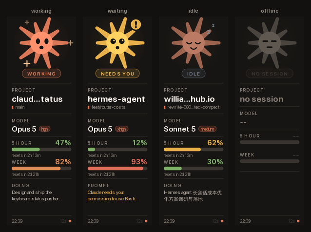

# claude-code-keyboard-status

Live [Claude Code](https://claude.com/claude-code) state on the 142×428 image
display of a mechanical keyboard: what Claude is doing right now, which project and
branch, which model, and how much of your 5-hour and weekly budget is gone.



The character on top is the whole point. From across a desk you cannot read 9-point
type, but you can tell a spinning orange bloom from a sleeping one — and the yellow
badge means Claude is blocked on a permission prompt and has been waiting for you.

## Install

```sh
curl -fsSL https://raw.githubusercontent.com/williamliu0516/claude-code-keyboard-status/main/install.sh | sh
```

That downloads `keyboard_status.py` to `~/.claude/`, builds a private virtualenv
with Pillow in it, loads a launchd agent that keeps the pusher running across
logins, and registers five hooks in `~/.claude/settings.json`, leaving every other
setting and every other tool's hooks alone. Re-run it to upgrade.

Needs macOS, `python3` (3.8+) with `venv`, and `curl` or `wget`. Then open a new
session, or restart an existing one, for the hooks to load — the daemon starts
pushing immediately either way.

The keyboard defaults to `192.168.0.12`. To point it somewhere else, edit `url` in
`~/.claude/keyboard-status.json` and the daemon picks it up on its next tick.

<details>
<summary>Install from a clone, or without hooks</summary>

```sh
git clone https://github.com/williamliu0516/claude-code-keyboard-status
python3 claude-code-keyboard-status/keyboard_status.py --install
```

`--install --no-hooks` sets up the daemon and never touches `settings.json`. You
lose the "needs your permission" state; everything else still works.
</details>

## Uninstall

```sh
python3 ~/.claude/keyboard-status.py --uninstall
```

Unloads the agent, deletes the script, the virtualenv, the state file and the
launchd plist, and removes exactly our five hook entries from `settings.json`.
Your `keyboard-status.json` is left alone, and so is
`~/.claude/statusline-usage.json`, which belongs to the sibling project below.

## What it shows

| Cell | Notes |
| --- | --- |
| character | the session state, as a pose — see the table below |
| state pill | the same thing in words, for when you are close enough to read it |
| project | basename of the active session's working directory |
| branch | current branch, `@a1b2c3d` when HEAD is detached, hidden outside a repo |
| model | `Opus 5`, `Sonnet 5`, … resolved from the session transcript |
| effort | the effort chip beside the model, when one is set |
| `5 HOUR` | 5-hour usage window: bar, percentage, time until reset |
| `WEEK` | weekly usage window, same |
| `DOING` | the session title Claude Code writes for the conversation, or the first of your prompt if it has not written one yet |
| footer | render clock, and how long ago the session last moved |

Bars are green below 50%, amber to 75%, orange to 90%, red above.

## The four states

| | Pose | Means |
| --- | --- | --- |
| **working** | clay bloom, turning, eyes tracking, sparks | a turn is in flight, or the transcript grew in the last 45 s |
| **waiting** | amber, wide eyes, `!` badge | Claude asked for permission and is blocked on you |
| **idle** | dusty rose, eyes closed, `z` | the turn ended, or nothing has happened for a while |
| **offline** | grey, flat eyes | no session found at all |

The bloom advances a few degrees every tick while working, which makes "still
alive" legible without reading anything. In every other state it holds still.

## Why a daemon *and* hooks

Neither half can do this job alone, and the split falls along the grain of the data.

**A hook-only design goes stale the moment you stop typing.** Two of the things on
screen — the 5-hour and weekly reset countdowns — move on wall-clock time, not on
anything a session does. A display that only redraws on session events freezes at
whatever it last saw and then quietly lies for hours, which is worse than showing
nothing.

**A daemon-only design cannot see state.** Whether Claude is thinking, waiting for
you to approve a tool call, or finished, is delivered to hook commands and written
nowhere a poller can reach. You can infer *liveness* from a transcript's mtime, but
you cannot tell "waiting for permission" from "still working" — and that is the one
distinction a glanceable display exists to make, because it is the one that wants
your attention.

So:

- **Five hooks** — `SessionStart`, `UserPromptSubmit`, `Notification`, `Stop`,
  `SessionEnd` — write one small JSON file and exit. They import nothing but the
  standard library, never touch the network, never print, and always exit 0. A hook
  that can fail is a hook that can wedge a session, so this one cannot fail: bad
  JSON, no stdin, a missing session id and an unwritable state file all exit 0 and
  change nothing. `PreToolUse`/`PostToolUse` are deliberately *not* registered —
  they fire on every tool call, and the daemon can already see that from the
  transcript.
- **A launchd daemon** owns everything expensive: Pillow, the usage poll, the JPEG
  encode, the POST. It ticks every 5 s, so wall-clock facts stay honest, and it
  reads the hooks' file, so event facts stay precise.

Everything the hooks provide is optional. Without them the daemon reads session
transcripts under `~/.claude/projects`, which carry the working directory, branch,
model, effort and the AI-written session title. That fallback simply cannot see a
permission prompt, which is exactly the gap the hooks close.

When the two disagree — and they constantly do — the resolver in `resolve_state`
prefers a permission prompt outright, treats a transcript that grew *after* the last
hook fired as proof the hook is behind, and otherwise falls back to liveness.

## Why it only pushes sometimes

The daemon renders every tick and pushes only when the JPEG actually changed, or
when the last successful push is more than five minutes old. In practice that is one
upload a minute while idle — the clock cell rolling over — and one per tick while
Claude is working and the character is turning.

The heartbeat exists because the keyboard is not a reliable store: it reboots, gets
unplugged, and drops what it was showing. Five minutes is the longest it can display
a frame nobody sent.

## Why the usage numbers need this much work

They are lifted, deliberately unchanged, from this project's sibling
[claude-status-bar](https://github.com/williamliu0516/claude-status-bar), and share
its cache file — so the keyboard and the terminal status line always agree, and
whichever of the two polls first spares the other a request.

The short version: the `rate_limits` block Claude Code exposes is a per-process,
in-memory cache with no refresh timer, so any single source is routinely hours
stale. Usage is instead merged from the shared cache, `cachedUsageUtilization` in
`~/.claude.json`, and a throttled poll of the usage endpoint, newest-wins: discard
windows whose reset has passed, prefer the latest boundary (compared with a ±120 s
tolerance, because each response recomputes it at its own sub-second precision), and
within a window take the largest reading, since usage only grows until it resets.
That project's README has the full argument.

Credentials are read, never written. The poll runs on a background thread, so a slow
response cannot stall the display.

## Configuration

`~/.claude/keyboard-status.json`, read fresh on every tick — no restart needed.

| Key | Default | Effect |
| --- | --- | --- |
| `url` | `http://192.168.0.12/image/upload` | where frames are POSTed |
| `width` / `height` | `142` / `428` | panel size; the layout is tuned for this one |
| `tick_seconds` | `5` | render cadence, and so how fast a state change shows up |
| `heartbeat_seconds` | `300` | push an unchanged frame at least this often |
| `offline_backoff_seconds` | `20` | wait after a failed push, growing to 60 s |
| `http_timeout_seconds` | `4` | POST timeout |
| `jpeg_quality` | `88` | 30–95 |
| `active_seconds` | `45` | transcript movement newer than this counts as working |
| `session_ttl_seconds` | `21600` | after this, a session stops being the current one |
| `usage_poll_seconds` | `60` | shared with claude-status-bar's own throttle |
| `show_task_title` | `true` | set false to drop the `DOING` cell |

`CLAUDE_KEYBOARD_URL`, `CLAUDE_KEYBOARD_TICK`, `CLAUDE_KEYBOARD_HEARTBEAT`,
`CLAUDE_KEYBOARD_TIMEOUT` and `CLAUDE_KEYBOARD_QUALITY` override the file, which is
mostly useful for one-off runs.

## Commands

| | |
| --- | --- |
| `--install [--no-hooks]` | install everything; idempotent |
| `--uninstall` | undo it |
| `--daemon` | run the push loop in the foreground (what launchd runs) |
| `--once` | render and push a single frame; exits non-zero if the push failed |
| `--preview out.png [state]` | render to a file without pushing; force a pose to see it |
| `--status` | dump the resolved status as JSON — the first stop when debugging |

Logs go to `~/.claude/keyboard-status.log`.

## The device

The panel accepts a raw `POST` of JPEG bytes:

```sh
curl -X POST --data-binary @image.jpg -H 'Content-Type: image/jpeg' \
  http://192.168.0.12/image/upload
```

It takes **baseline** JPEG only, at most 512 KB. Pillow writes baseline unless you
ask for progressive, so `encode` simply never passes `progressive`; at 142×428 a
frame is about 17 KB, and the quality-reduction loop guarding the ceiling is there
for a bigger future panel rather than for this one.

## Known limitations

- **macOS only, for the automatic part.** The daemon is plain Python and runs
  anywhere; only `--install`'s launchd agent is Apple-specific. On Linux, write a
  systemd user unit that runs `keyboard_status.py --daemon`.
- **One session on screen at a time.** With several sessions running, the panel
  follows whichever moved most recently. There is no room on 142 px to do better.
- **No authentication, no TLS.** The device offers neither, so the daemon assumes a
  LAN it trusts. Do not expose that endpoint to a network you do not control.
- **A sleeping panel drops frames.** Some of these keyboards power the display down
  and stop answering; the daemon keeps retrying at up to a minute apart, and the
  panel keeps showing the last frame that landed. Nothing is queued.
- **`DOING` starts as your prompt.** Claude Code writes the conversation title a
  little way into a session, so until it does, that cell shows the beginning of the
  prompt instead.
- **Concurrent hooks can lose an event.** Two sessions writing the state file at the
  same instant race on read-modify-write; the loser's event is dropped and the next
  tick re-resolves from the transcript anyway.
- **No "thinking" vs "running a tool" distinction.** Both are `working`. Telling
  them apart would mean a `PreToolUse` hook on every call, which is not worth it.

## License

MIT
